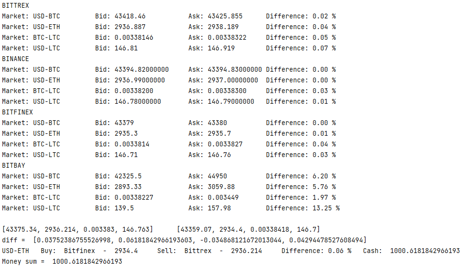

# Cryptocurrency Exchange Simulator 
Performing arbitrage on multiple exchanges in real time using API.
The program manages a virtual wallet and conducts arbitrage to generate profit. 
To maximise profit, the program selects the cryptocurrency at which the arbitrage is highest at any given time.  

Buying cryptocurrencies is possible with dollars, and other cryptocurrencies. 
Arbitrage is carried out on 4 selected cryptocurrency exchanges via API. 
The initial balance of the portfolio is equal to $1,000.00.  

Selected cryptocurrency exchanges:  
- BITTREX
- BINANCE
- BITFINEX
- BITBAY 

Selected cryptocurrencies:  
- Bitcoin
- Ethereum
- Litecoin  
 

Results:

